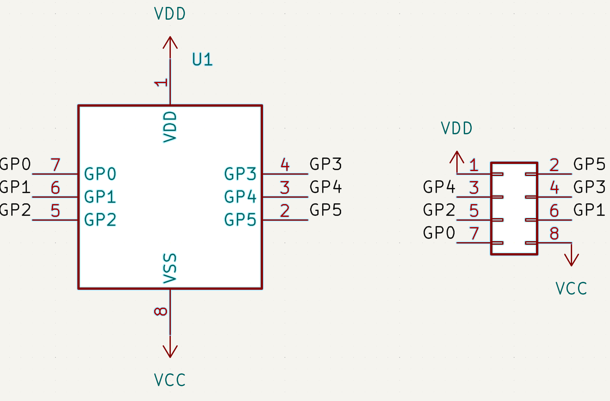
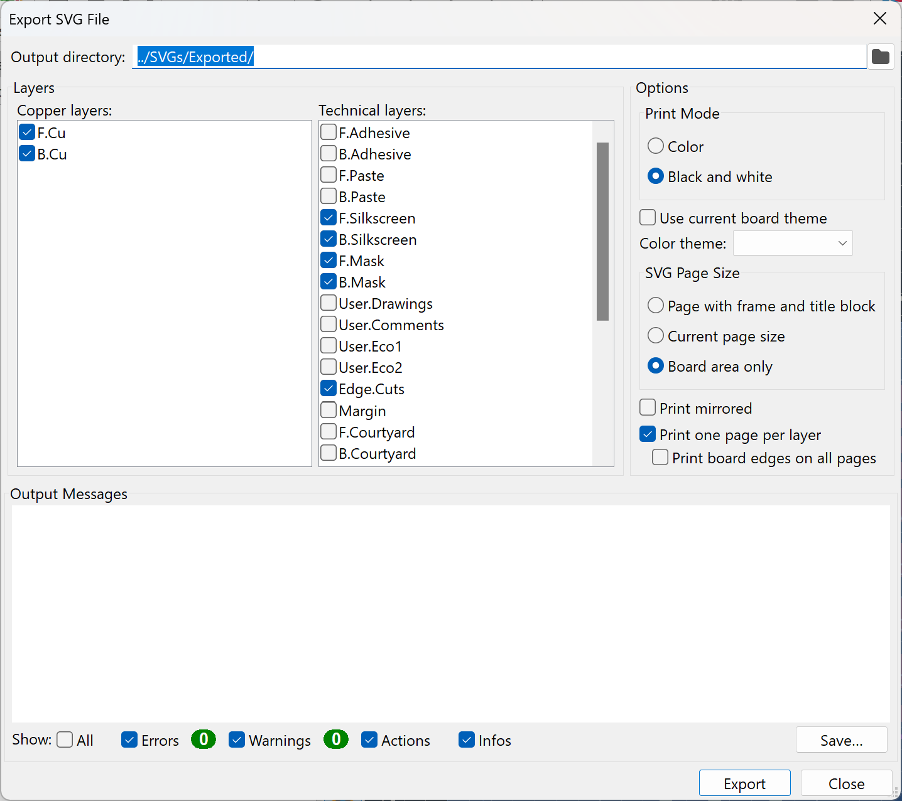
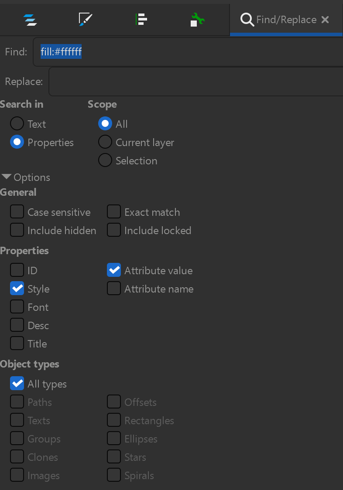
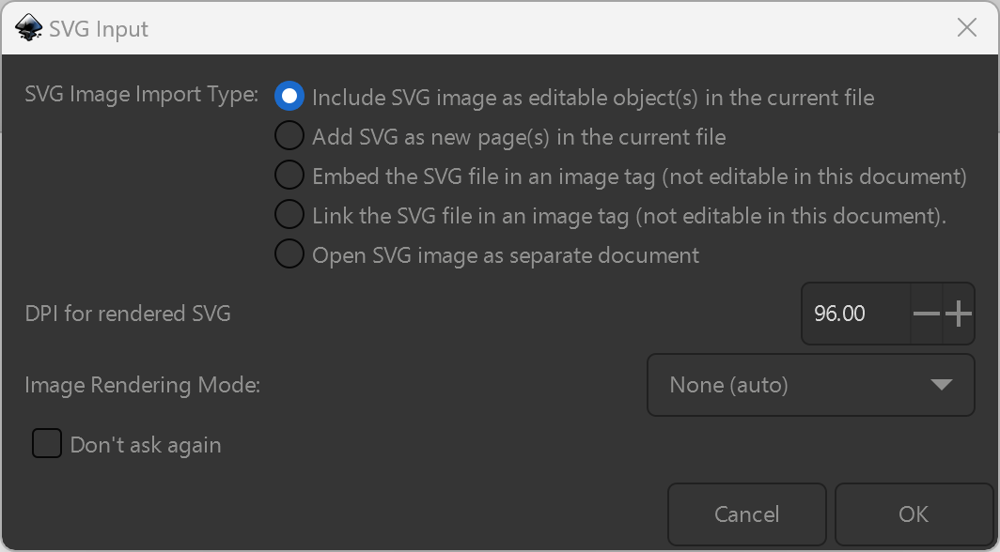
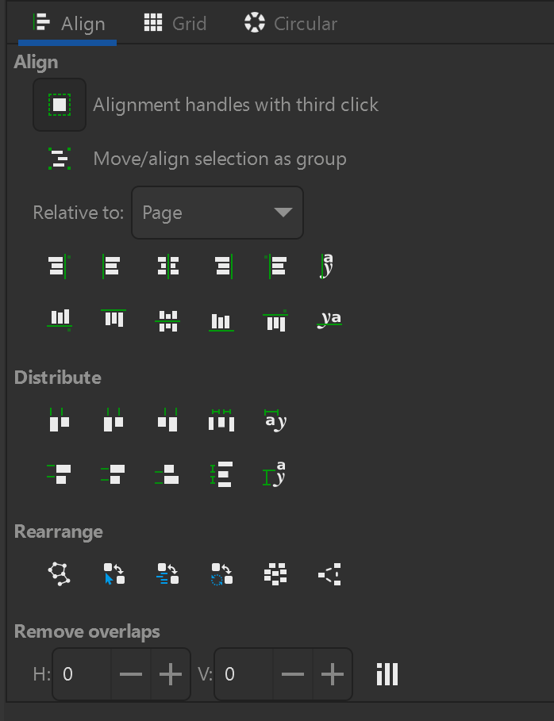
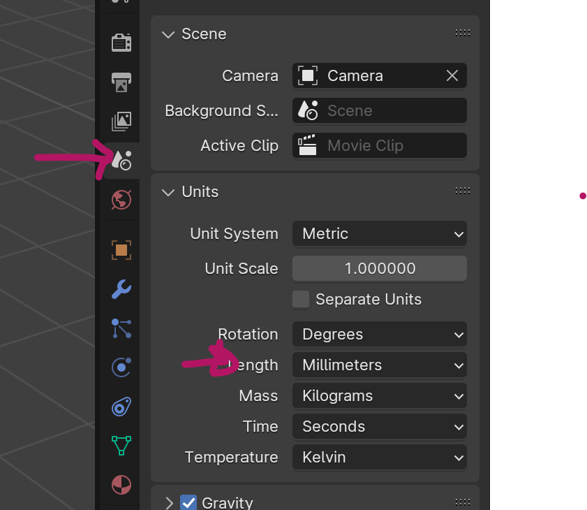

# Seattle Makers PCB Day Graphic
This is a walkthrough on how to make an illustration of
 PCB fabrication layers
in Blender.

## Make a board in KiCAD
In this case, the goal is to make something uncomplicated
 for illustration
purposes. I want:
* A surface mount component; in this case I picked an MSOP-8 package
* ([PIC12F683-xMS](https://ww1.microchip.com/downloads/en/DeviceDoc/41232D.pdf))
* A through-hole component; in this case I picked an 4x2 1mm pitch pin header
* Several traces connecting pads
 Silkscreen on both top and back.
 A via
 A
* filled region (ground plane)
 Thermal reliefs on a pad.

Here's the circuit:
 
 and here's the PCB
layout:


I could easily have routed pin1 from the header to pin 1 of
 the IC, but I
wanted to have a via for illustration purposes.

The edge cuts turned out to be a 15mm x 7mm rectangle.

The next step is to export layers as SVG files.



I wanted:
* Layers:
 Front Cu
 Back Cu
 Front Soldermask
 Back Soldermask
 Front
* Silkscreen
 Back Silkscreen
 Edge Cuts
 Black & White
 One page per layer
* Board area only

## Inkscape cleanup
The export is a little messy for Blender to directly
 import, and can be reformated a bit.

Here's the general plan:
1. Open the SVG in Inkscape
2. Select all and remove groups (Ctrl-A, Ctrl-G) repeatedly until there are no groups
3. For any stroked lines (rather than filled regions), convert to filled regions by:
    - Select All (Ctrl-A) and Stroke to path (Ctrl-Alt-C)
    - That might make groups, so select and remove them (Ctrl-A, Ctrl-G)
4. Union the result into a single curve (Ctrl-Plus which is really Ctrl-Shift-Equals)
5. Save the simplified result in a different folder.

But there are some tweaks. We're going to make:
### Front/Back Silkscreen
Just follow the directions above on the -B_Silkscreen.svg and -F_Silkscreencu.svg files.

### Front/Back Copper
KiCAD models holes as white shapes (circles) on top of black copper and that's not
helpful to Blender.

So open the -B_Cu.svg or F_Cu.svg file and do step \#1.

After you remove the groups, convert anything stroked with white
to paths using Find/Replace (Ctrl-F):
* Find: "stroke:#ffffff"
* Search in: Properties
* Attribute value
* Scope: All
* Options/Properties: Style
* Options/Objectd types: all types

And if you selected anything, convert to paths (Ctrl-Alt-C).

Then add anything filled with white using Find/Replace (Ctrl-F):
* Find: "fill:#ffffff"
* Search in: Properties
* Attribute value
* Scope: All
* Options/Properties: Style
* Options/Objectd types: all types
* 

Union those (Ctrl-Plus).

Now make sure the unioned path is selected and invert the selection to get the rest of
the content. Convert any stroked lines to paths, union that. Finally make sure the white is above the black,
select them both, and difference them (Ctrl-Minus).

### Front/Back Solder mask
Open the -B_Mask.svg or -F_Mask.svg file. It will have the unmasked areas as black; we want to invert that.
So go through all the ungrouping, stroke-to-path-, and union steps. But then Import (Ctrl-I)
the -Edge_Cuts.svg file. Be careful that the placement is OK, so use Align and Distribute (Shift-Ctrl-A), set
the "Relative to" to be "Page" and do both horizontal and vertical center.

If necessary, have that ungrouped, stroke-to-path, and union it. (Be sure not to include
the original mask). Make sure the original mask is above the edge cuts and difference (Ctrl-Minus).

|new layer|how to build it|
|-|-|
|Back Silkscreen|Just use the recipie above|
|Front Silkscreen|Same|
|Back Copper|KiCAD models this as white holes on top of black copper which confuses Blender.|
4. Select any white-filled objects and union them
    - If you can find one, just right click and Select Same with the fill color: 
5. Union the rest (assuming holes are selected, Invert Selection with !)


* Some of the lines are thick strokes and others are filled
areas; Inkscape can convert them all to filled areas
* Drill holes are white circles in the copper layer and it's simpler to just
* remove those and save them separately.
 There are a bunch of groups which
aren't needed
 Complex regions can have vectors going both directions; Blender
* likes simple closed regions (with other regions inside it)

Here's the general process:

1. Open the SVG file in Inkscape. It should look just like you want, but might have
an internal structure that is hard for Blender to handle.
2. Go to the "Layers and Groups" panel and select all the groups with Ctrl-A.
Ungroup them with Shift-Ctrl-G. You may need to do this multiple times if there
are nested groups.


3. For front and back copper layers:
    1. Select any white circle.
    2. 
    3. Union them (Ctrl-Plus)
    4. Invert Selection (!)
    5. Do a Stroke to path (Ctrl-Alt-C)
    6. Union that (Ctrl-Plus)
    7. Make sure the unioned circles are above other curve in the Layers and Objects pane
    8. Difference those (Ctrl-Minus)
4. For Soldermask layers:
    1. Select All (Ctrl-A)
    2. Do a Stroke to path (Ctrl-Alt-C)
       * If that did anything, expand the groups again (Ctrl-A, Shift-Ctrl-G)
    3. Union (Ctrl-Plus)
    4. Import the edge cuts SVG and accept the default values 
    5. Use "Align and distribute" (Shift-Ctrl-A) to put it on the page 
    6. Make sure the holes silkscreen holes are above the edge cuts in Layers and Objects.
    7. Select all (Ctrl-A) and difference the paths (Ctrl-Minus)
    8. Make sure the path is filled
    9. Repeat the first 3 steps and save as "ENIG" rather than "Mask"
        * TODO: Need holes in ENIG
5. For the edge cuts:
    1. Open a Cu layer instead
    2. Select a white circle and select same fill color like you did for the real copper layer
    3. Union them (Ctrl-Plus)
    4. Invert selection (!)
    5. Delete
    6. Import the edge cuts
    7. Ensure they're centered on the page
    8. Ensure they're below the holes
    9. Select both curves and difference (Ctrl-Minus)
    10. Fill the result with black
    11. Save it as firberglass
6. For silkscreen layers:
    1. Select All (Ctrl-A)
    2. Do a Stroke to path (Ctrl-Alt-C)
       * If that did anything, expand the groups again (Ctrl-A, Shift-Ctrl-G)
    3. Union (Ctrl-Plus)
9. Save As to a different folder.

## Blender
The overall plan is to:
1. For each SVG above, import it as a curve
2. Extrude the curve a fixed amount
3. Convert the curve to a mesh
4. Scale the mesh to the right thickness (.5m since it goes up and down that amount)
6. Set the Z
2. Import the simplified SVG files and intersect (or diference for soldermask) to get the right shape.
3. Animate them to make the layering more obvious.
4. Zoom to parts of the board to illustrate the names.

### Layers
We're going to have:
|Name|Thickness|bottom height (normal)|bottom height (exploded)|
|-|-:|-:|-:|
Front Silkscreen|0.01|1.73|80.00|
Front HASL/ENIG|0.01|1.72|70.00|
Front Soldermask|0.01|1.72|60.00|
Front Copper|0.05|1.67|50.00|
Fiberglass|1.60|0.07|40.00|
Back Copper|0.05|0.02|30.00|
Back Soldermask|0.01|0.01|20.00|
Back HASL/ENIG|0.01|0.01|10.00|
Back Silkscreen|0.01|0.00|0.00|

Start Blender and pick "General". By default, the units are meters which is way too big for what we're working in. So go to "scene" and change the length units to milimeters:


Delete the default cube.

Make a new collection and
rename it "Layers". 

In the "File" menu, pick "Import" and from the "simplified" folder you put the
Inkscape output files in, select the B_Silkscreen file. This
will pull in a curve, but it will be much smaller
than the cube, so zoom in close to the origin.

Select the curve tab on the left panel, expand "Geometry",
and extrude by 100mm


Next go to the material tab and:
1. Rename it to "Silkscreen"
2. Change the base color to pure white #FFFFFF
3. Turn the "Roughness" down to 0.
4. Check the preview; it should look like a shiny white ball
5. In the "Viewport Display" section, make the color pure white #FFFFFF.

Now you have a white cube which has been flattened/stretched to the right
dimentions. Let's cut it down to just the silkscreen.

In the "File" menu, pick "Import" and, from the "simplified" folder, pick the B_Silkscreen file.

```python
from os import listdir
import os.path

# TODO: set root of project
svg_path="<root of project>\\SeattleMakersPCBDayGraphic\\SVGs\\Simplified"
for svg_file in listdir(svg_path):
    bpy.ops.import_curve.svg(filepath=os.path.join(svg_path, svg_file))
    o = bpy.data.collections[svg_file].objects.values()[0]
    o.name = svg_file
    o.data.name = svg_file
    o.data.extrude = 0.1
    o.select_set(True)
    bpy.ops.object.convert(target='MESH')
    o.select_set(False)
```